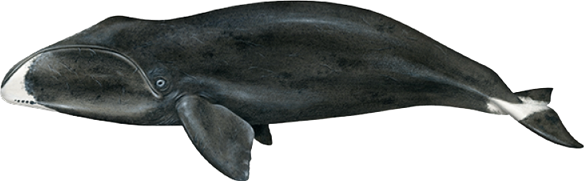

\begin{center}

Students: 220024321, 180015716, 220013309

\end{center}
\

```{r Libraries and Logo, fig.align="center", message=FALSE, echo = FALSE, warning=FALSE, echox=FALSE, out.width="0.50\\linewidth"}
library(knitr)


```

\newpage 

### Abstract

### Introduction

### Methods

**Data Collection**
\
To observe bowhead whales, visual aerial line-transect surveys were conducted in coast land offshore areas in West Greenland between 65°400N and 75°300N,  largely covering the area of the local spring aggregation in Disko Bay. The study region on 242,650km^2^ was divided into 16 strata based on prior knowledge of anticipated densities of bowhead whales. Between 24th March and 14th April 2012 7,836.5km of total east-west oriented transect lines were observed, with the targeted altitude and speed being 213m and 167 km/h respectively. Surveying was only carried out if Beaufort Sea States Code was 2 or less, i.e. only when the sea was calm. Inclinometers were used to measure the angle of declination for each observed group of bowhead whales (Suunto). The angles were then converted to perpendicular distances ($x$) using the following equation from Buckland et al. (2001): $x = v * tan(90 - \psi )$, where $v$ is the altitude of the airplane, $\psi$ is the declination angle. Forward distance ($y$) to each sighting was calculated based on time of first sighting, time when passing abeam and speed of aircraft. For a more extensive description of the data collection refer to Rekdal et al. (2015).

**Distance Sampling**
\
To estimate the abundance of bowhead whales, a sample representative portion of the area, i.e. the plot distance sampling, is used. Distance sampling is used in ecological surveys to account for imperfect detections and is incredibly useful considering limited resources. The bowhead whales further away are less likely to be detected, thus distance is employed as a detection bias. The detection function describes how detectability varies with distance, it includes the proportion of animals seen at a given distance and a probability of seeing an animal at a given distance.
To employ the distance sampling, first of the assumptions need to be met:
\
- the transect lines were placed at random and the bowhead whales were not affected by their placement; 
\
- animals on the transect line, in this case from 213m altitude of the plane were seen with probability p = 1; 
\
- perpendicular distances from line to bowhead whales are uniform random variables $\pi(x) = 1/w$;
\
- distances were measured without error and to the initial location.
\

To then define the detection function $g(x)$, with the assumptions stated above fulfilled, the key functions are fitted to the model:
\
- Half-normal $g(x) = \exp(-x^2 / 2\sigma^2)$,
\
- Hazard-rate $g(x) = \exp(-(x / \sigma)^{-b})$,
\
where $\sigma$ is a scale parameter (“standard deviation”) and $b$ controls the width of the shoulder.


**Data Analysis**
\
Due to an obscured view close to the transect line, detections were left-truncated at 100m Rekdal et al. (2015).
\
8 models were fit to the distance data using all combinations of hazard-rate and half-normal detection functions with cosine, hermite polynomial and simple polynomial adjustments. Model selection using Akaike information criterion (AIC) found that the best model was a half-normal with no adjustments (see figure 1). AICc was also applied due to the ratio of model parameters to observation being less than 1:40 and found the same result (Takezawa, 2014). This model had an good fit; Cramer-von Mises test (T = 0.073, p = 0.732), bootstrap Kolmogorov-Smirnov test for goodness-of-fit (D = 0.073, p = 1). Additionally a QQ-plot comparing empirical and fitted CDF had points lying approximately on the 1:1 line (see figure 1).

```{r Model Fit Plot, echo = FALSE, warning = FALSE, results = "hide", message = FALSE}
#####    SETTING UP    #####

# Getting Package Statsecol from github which contains the data
remotes::install_github("https://github.com/chrissuthy/statsecol")
# Loading in the data package
library(statsecol)
# Set up libraries 
library(Distance)
library(tidyverse)
library(remotes)
library(MuMIn)

# First fit the most basic model to explore it.
# Distance model with half-normal key function, no adjustment.
hn <- ds(data = bowhead_LT, 
         # Half-normal
         key = "hn", 
         # No adjustment argument
         adjustment = NULL) 

# Setting plot size
par(mfrow = c(1,2), mar = c(5.5, 4, 2, 2) + 0.1, oma = c(1, 1, 1, 1))

# Plotting the detection function over the distances distribution
plot(hn, 
     which = 2, 
     pl.col = adjustcolor("seagreen", 0.5), 
     border = NULL,
     ylab = "Detection probability (g(x))", 
     xlab = "Distance", 
     main = "A",
     lwd = 1.4,
     bg = alpha("darkgoldenrod2", 0.3),
     pch = 21)

# Plotting and running the Cramer-von Mises test
gof_ds(hn, 
       main = "B",
       lwd = 1.4,
       pch = 21,
       col = "darkgoldenrod4",
       bg = alpha("darkgoldenrod2", 0.3))
# Create the labels for figures
subtitle = ("Figure 2: Half-Normal No Adjustment Model Fit. A is the model fit over the distribution \nof distances. B is the QQ-plot of the expected vs observed CDF")

# Print out the labels for figures
mtext(side = 1, adj = 0, cex = 0.7, subtitle, outer = TRUE)
``` 

### Results
\
**Individuals**
\
The model estimated the average detectability of individual bowhead whales to be 0.474. 

The estimated abundance of individual Bowhead whales was highest in strata 2 (138.83, CI: 291.53; 66.11) and lowest in strata 15 (5.12, CI: 39.44; 0.67). 

```{r Individual Abundance Plot, echo = FALSE, warning = FALSE, results = "hide", message = FALSE}

# Making the data 
region_table <- unique(bowhead_LT[, c("Region.Label", 
                                      "Area")])

# Region and sample labels, effort
sample_table <- unique(bowhead_LT[, c("Region.Label", 
                                      "Sample.Label", 
                                      "Effort")])

# Object, region and sample labels
observation_table <- unique(bowhead_LT[, c("object", 
                                           "Region.Label", 
                                           "Sample.Label")])

# Finding the abundance and CI
abund_bio_hn <- dht(model = hn$ddf,
                    region_table, 
                    sample_table, 
                    observation_table)


# Viewing the abundance and CI and getting the tables for plotting

# Estimated Abundance of individuals
N_ind <- abund_bio_hn$individuals$N 

# Estimated density of individuals 
d_ind <- abund_bio_hn$individuals$D


## INDIVIDUALS ##
# Changing the Region label to a factor
    # This allows it to be plotted in a desired order
N_ind <- N_ind %>%
  mutate(Label = factor(Label, levels = c('2', '3', '9', 
                                       '11', '12', '15',
                                       'Total'))) 

# Plotting estimates abundance data 
ggplot(N_ind)+
  geom_point(aes(x = Label, y = Estimate), 
             size = 2, 
             stat = "identity", 
             colour = 'blue')+
  
  # Adding lines for Confidence Intervals
  geom_linerange(aes(x = Label, 
                     ymin = lcl,
                     ymax = ucl), colour = 'darkblue')+
  
  # Addding labels for axis and figure legend
  xlab('Survey Strata')+
  ylab('Estimated Abundance')+
  labs(caption = 'Figure 3: The estimated abundance of Bowhead whale individuals in each strata (blue dot) and \n the confidence intervals (blue) lines)')+
  
  # Making the caption sit at the left
  theme(plot.caption = element_text(hjust = 0))+
  
  # Adding more Y axis ticks to make estimates easier to interpret
  scale_y_continuous(breaks = round(seq(min(N_ind$lcl),
                                        max(N_ind$ucl), 
                                        by = 100)))+
  # Title for easy distingishing
  labs(title = 'Individual Abundance')

```

\


**Clusters**
\
```{r Cluster Abundance plot, echo = FALSE, warning = FALSE, results = "hide", message = FALSE }
## CLUSTERS ##

# Estimated density of clusters
d_clu <- abund_bio_hn$clusters$D

# Estimated Abundance of clusters
N_clu <- abund_bio_hn$clusters$N 


# Changing the Region label to a factor
# This allows it to be plotted in a desired order
N_clu <- N_clu %>%
  mutate(Label = factor(Label, levels = c('2', '3', '9', 
                                       '11', '12', '15',
                                       'Total')))

# Plotting estimated abundance data 
ggplot(N_clu)+
  geom_point(aes(x = Label, y = Estimate), 
             size = 2, 
             stat = "identity", 
             colour = '#66FF00')+
  
  # Adding lines for Confidence Intervals
  geom_linerange(aes(x = Label, 
                     ymin = lcl,
                     ymax = ucl), colour = 'darkgreen')+
  
  # Addding labels for axis and figure legend
  xlab('Survey Strata')+
  ylab('Estimated Abundance')+
  labs(caption = 'Figure 5: The estimated abundance of Bowhead whale clusters in each strata (green dot) and \n the confidence intervals (green lines)')+
  
  # Making the caption sit at the left
  theme(plot.caption = element_text(hjust = 0))+
  
  # Adding more Y axis ticks to make estimates easier to interpret
  scale_y_continuous(breaks = round(seq(min(N_clu$lcl),
                                        max(N_clu$ucl), 
                                        by = 100)))+
  # Title for distingusing graphs
  labs(title = 'Cluster Abundance')


```
\
```{r Table with results, echo = False, warning = False, results = "hide", message = FALSE, r="asis"}
# Results table for individuals
abundance_table_ind <- N_ind[, c(1:2, 5:6)]
# Round to 2 decimal places
abundance_table_ind <- round(abundance_table_ind[, 2:4], 2)
# Rename columns
colnames(abundance_table_ind) <- c("Estimate", "Lower CI", "Upper Cl")

# Do the same with cluster table
abundance_table_clu <- N_ind[, c(1:2, 5:6)]
# Round to 2 decimal places
abundance_table_clu <- round(abundance_table_clu[, 2:4], 2)
# Rename columns
colnames(abundance_table_clu) <- c("Estimate", "Lower CI", "Upper Cl")

# Print tables side by side
grid.arrange(
  # Table 1
  tableGrob(
    kable(
      abundance_table_ind,
      align = "c",
      caption = "Abundance Estimates for Individuals"
    )
  ),
  # Table 2
  tableGrob(
    kable(
      abundance_table_clu,
      align = "c",
      caption = "Abundance Estimates for Clusters"
    )
  ),
  ncol = 2
)

```

\

\


### Discussion

### References

### Appendix

R Analysis Code
```{r Setting up, echo=TRUE, eval=FALSE}
#####    SETTING UP    #####

# Getting Package Statsecol from github which contains the data
remotes::install_github("https://github.com/chrissuthy/statsecol")
# Loading in the data package
library(statsecol)
# Set up libraries 
library(Distance)
library(tidyverse)
library(remotes)
library(MuMIn)
```
\
```{r Exploratory Analysis, echo=TRUE, eval=FALSE}
#####    EXPLORATORY ANALYSIS    #####

# Inspect data
df <- str(bowhead_LT)

# Looking at the distribution of the distances
# Setting up the plot size
par(mfrow = c(1,1), 
    # Set margins
    mar = c(5, 4, 4, 2) + 0.1) 
# Plot histogram of distances
hist(bowhead_LT$distance,
     # Naming x-axis 
     xlab = "Distance (km)", 
     # Naming y axis
     ylab = "Number of Bowhead Whales",  
     # Naming plot 
     main = "Distances of Bowhead Whales from Line Transects",
     # Changing colour and intensity of bars
     col = adjustcolor("seagreen", 0.5), 
     # Changing orientation of x-axis tick labels
     las = 1) 

# Print out fice rows of original data frame
kable(df[4:9, ], caption = "First five rows from the original data frame")
```
\
```{r Modelling, echo=TRUE, eval=FALSE}
#####     MODELLING     #####

# Due to the long shoulder seen in the histogram, first fit a hazard rate;
#   then fit a half-normal


# Fitting hazard-rate detection functions with all adjustment terms 

# Hazard-rate with no adjustment 
hr <- ds(data = bowhead_LT, 
         key = "hr", 
         adjustment = NULL) 

# Hazard-rate with a cosine adjustment 
hr_cos <- ds(data = bowhead_LT, 
             key = "hr", 
             adjustment = "cos")

# Hazard-rate with a hermite polynomial adjustment 
hr_herm <- ds(data = bowhead_LT, 
              key = "hr", 
              adjustment = "herm")

# Hazard-rate with a simple polynomial adjustment 
hr_poly <- ds(data = bowhead_LT, 
              key = "hr", 
              adjustment = "poly") 


# Fitting half-normal detection functions with all adjustment terms 

# Half-normal with no adjustment 
hn <- ds(data = bowhead_LT, 
         key = "hn", 
         adjustment = NULL) 

# Half-normal with a cosine adjustment
hn_cos <- ds(data = bowhead_LT, 
             key = "hn", 
             adjustment = "cos") 

# Half-normal with a hermite polynomial adjustment
hn_herm <- ds(data = bowhead_LT, 
              key = "hn", 
              adjustment = "herm")

# Half-normal with a simple polynomial adjustment
hn_poly <- ds(data = bowhead_LT, 
              key = "hn", 
              adjustment = "poly")
```
\
```{r Model Selection, echo=TRUE, eval=FALSE}
#####     MODEL SELECTION     #####

# Comparing Models graphically by fit of detection probability over 
#   distance distribution

# Half-normal detection function over histogram plot
# Setting up plot size and margins
par(mfrow = c(2, 2), 
    # Set margins
    mar = c(5, 4, 4, 2) + 0.1) 

# Plotting all 4 half-normal models
plot(hn, 
     pl.col = adjustcolor("seagreen", 0.5),
     lwd = 1.2,
     bg = alpha("darkgoldenrod2", 0.3),
     pch = 21,
     main = "No Adjustment") 
plot(hn_cos,
     pl.col = adjustcolor("seagreen", 0.5),
     lwd = 1.2,
     bg = alpha("darkgoldenrod2", 0.3),
     pch = 21,
     main = "Cosine")
plot(hn_poly, 
     pl.col = adjustcolor("seagreen", 0.5),
     lwd = 1.2,
     bg = alpha("darkgoldenrod2", 0.3),
     pch = 21,
     main = "Polynomial")
plot(hn_herm, 
     pl.col = adjustcolor("seagreen", 0.5),
     lwd = 1.2,
     bg = alpha("darkgoldenrod2", 0.3),
     pch = 21,
     main = "Hermite Polynomial")
# Include titles for all of the plots
title("Half-Normal Models", 
      line = -1, 
      # Naming title and setting location
      outer = TRUE) 


# Hazard-rate Detection function over histogram plot
par(mfrow = c(2, 2), 
    # Setting up plot size and margins
    mar = c(5, 4, 4, 2) + 0.1) 

# Plotting all 4 hazard-rate models
plot(hr, 
     pl.col = adjustcolor("seagreen", 0.5),
     lwd = 1.2,
     bg = alpha("darkgoldenrod2", 0.3),
     pch = 21,
     main = "No Adjustment")
plot(hr_cos, 
     pl.col = adjustcolor("seagreen", 0.5),
     lwd = 1.2,
     bg = alpha("darkgoldenrod2", 0.3),
     pch = 21,
     main = "Cosine")
plot(hr_poly, 
     pl.col = adjustcolor("seagreen", 0.5),
     lwd = 1.2,
     bg = alpha("darkgoldenrod2", 0.3),
     pch = 21,
     main = "Polynomial")
plot(hr_herm, 
     pl.col = adjustcolor("seagreen", 0.5),
     lwd = 1.2,
     bg = alpha("darkgoldenrod2", 0.3),
     pch = 21,
     main = "Hermite Polynomial")
title("Hazard-Rate Models", 
      line = -1, 
      # Naming title and setting location
      outer = TRUE)

# Comparing AIC of all the models 
summarize_ds_models(hn, hn_cos, hn_herm, hn_poly, 
                    hr, hr_cos, hr_herm, hr_poly,
                    # Setting Plain instead of equations
                    output = "plain")

# As the dataset is small, checking whether AICc is a more appropriate measure
# To do this, Takezawa (2014) has said AICc should be used when the ratio of 
# your parameters to number of data points is less than 1:40

# Print summary of hazard-rate distance model
summary(hr)
  # Parameters = 2 : Observations = 58
  # Therefore ratio is 1:29
  #   This ratio will be even smaller for the models with adjustments 

# Print summary of half-normal distance model
summary(hn)
  # This is the only model that meets the assumptions of AIC however as you 
  #   Can't compare across model selection parameters we will use AICc

# Using AICc to select models 
AICc(hn, hn_cos, hn_herm, hn_poly, 
     hr, hr_cos, hr_herm, hr_poly)

# Despite this there is no change in the best model

# The half-normal will be chosen as it has the smallest AIC and AICc
# No adjustment will be chosen as the adjustments don"t model extra variability 
#   in the data 
```
\
```{r Model Fit, echo=TRUE, eval=FALSE}
#####     MODEL FIT     #####

# Comparing the detection function to the cramer-von mises test

# Setting plot size
par(mfrow = c(1,2), 
    # Set margins
    mar = c(5, 4, 4, 2) + 0.1)

# Plotting the detetion function over the distances distribution
plot(hn, 
     which = 2, 
     pl.col = adjustcolor("seagreen", 0.5), 
     border = NULL,
     ylab = "Detection probability (g(x))", 
     xlab = "Distance", 
     las = 1,
     lwd = 1.4,
     bg = alpha("darkgoldenrod2", 0.3),
     pch = 21,
     main = "Half-normal Model No Adjustments")

# Plotting and running the Cramer-von Mises test and bootstrap Kolmogorov-Smirnov      
#   test for goodness-of-fit

gof_ds(hn, 
       main = "Expected vs Observed CDF", 
       lwd = 1.4,
       pch = 21,
       bg = alpha("darkgoldenrod2", 0.3),
       ks = TRUE,
       col = "darkgoldenrod4")

  # The Cramer-von Mises test gives a test statistic of 0.0732325 and a p-value 
  #   of 0.731882
  # The Kolomogorov-Smirnov test gives a test statistic stat of 0.0725551 and a             
  #   p-value of 1

# Therefore the model has a good fit as the p values are much more than 0.05
```
\
```{r Model Inference, echo=TRUE, eval=FALSE}
#####     MODEL INFERENCE     #####
# Print summary of the model
summary(hn)

# Creating subsets of the column combinations needed for dht() density and 
#   abundance estimate and variances function.
# Region labels and areas. 
region_table <- unique(bowhead_LT[, c("Region.Label", 
                                      "Area")])

# Region and sample labels, effort
sample_table <- unique(bowhead_LT[, c("Region.Label", 
                                      "Sample.Label", 
                                      "Effort")])

# Object, region and sample labels
observation_table <- unique(bowhead_LT[, c("object", 
                                           "Region.Label", 
                                           "Sample.Label")])

# Finding the abundance and CI
abund_bio_hn <- dht(model = hn$ddf,
                    region_table, 
                    sample_table, 
                    observation_table)


# Viewing the abundance and CI and getting the tables for plotting

# Estimated Abundance of individuals
N_ind <- abund_bio_hn$individuals$N 
N_ind

# Estimated Abundance of clusters
N_clu <- abund_bio_hn$clusters$N 
N_clu

# Estimated density of individuals 
d_ind <- abund_bio_hn$individuals$D
d_ind 

# Estimated density of clusters
d_clu <- abund_bio_hn$clusters$D
d_clu

# Average probability of detection for individuals
abund_bio_hn$individuals$average.p 

# Average probability of detection for clusters
abund_bio_hn$clusters$average.p 

```
\
```{r Results Graphs, echo=TRUE, eval=FALSE}
##### GRAPHS FOR RESULTS #####

## INDIVIDUALS ##
# Changing the Region label to a factor
    # This allows it to be plotted in a desired order
N_ind <- N_ind %>%
  mutate(Label = factor(Label, levels = c('2', '3', '9', 
                                       '11', '12', '15',
                                       'Total'))) 

# Plotting estimates abundance data 
ggplot(N_ind)+
  geom_point(aes(x = Label, y = Estimate), 
             size = 2, 
             stat = "identity", 
             colour = 'blue')+
  
  # Adding lines for Confidence Intervals
  geom_linerange(aes(x = Label, 
                     ymin = lcl,
                     ymax = ucl), colour = 'darkblue')+
  
  # Addding labels for axis and figure legend
  xlab('Survey Strata')+
  ylab('Estimated Abundance')+
  labs(caption = 'Figure 2: The estimated abundance of Bowhead whale individuals in each strata (blue dot) and \n the confidence intervals (blue) lines)')+
  
  # Making the caption sit at the left
  theme(plot.caption = element_text(hjust = 0))+
  
  # Adding more Y axis ticks to make estimates easier to interpret
  scale_y_continuous(breaks = round(seq(min(N_ind$lcl),
                                        max(N_ind$ucl), 
                                        by = 100)))+
  # Title for easy distingishing
  labs(title = 'Individual Abundance')


# Plotting individual estimated density data 
d_ind <- d_ind %>%
  mutate(Label = factor(Label, levels = c('2', '3', '9', 
                                       '11', '12', '15',
                                       'Total')))
ggplot(d_ind)+
  geom_point(aes(x = Label, y = Estimate), 
             stat = "identity", 
             size = 2,
             colour = 'blue') +
  
  # Adding errorbars for Confidence Intervals
  geom_errorbar(aes(x = Label, 
                    ymin = lcl,
                    ymax = ucl), colour = 'darkblue')+
  
  # Addding labels for axis and figure legend
  xlab('Survey Strata')+
  ylab('Estimated Density')+
  labs(caption = 'Figure 3: The estimated density of Bowhead whale individuals in each strata (green dot) and \n the confidence intervals (green lines)')+
  
  # Making the caption sit at the left
  theme(plot.caption = element_text(hjust = 0))+
  
  # Title to distinguish graphs
  labs(title = 'Individual Density')


## CLUSTERS ##

# Changing the Region label to a factor
# This allows it to be plotted in a desired order
N_clu <- N_clu %>%
  mutate(Label = factor(Label, levels = c('2', '3', '9', 
                                       '11', '12', '15',
                                       'Total')))

# Plotting estimated abundance data 
ggplot(N_clu)+
  geom_point(aes(x = Label, y = Estimate), 
             size = 2, 
             stat = "identity", 
             colour = '#66FF00')+
  
  # Adding lines for Confidence Intervals
  geom_linerange(aes(x = Label, 
                     ymin = lcl,
                     ymax = ucl), colour = 'darkgreen')+
  
  # Addding labels for axis and figure legend
  xlab('Survey Strata')+
  ylab('Estimated Abundance')+
  labs(caption = 'Figure 4: The estimated abundance of Bowhead whale clusters in each strata (green dot) and \n the confidence intervals (green lines)')+
  
  # Making the caption sit at the left
  theme(plot.caption = element_text(hjust = 0))+
  
  # Adding more Y axis ticks to make estimates easier to interpret
  scale_y_continuous(breaks = round(seq(min(N_clu$lcl),
                                        max(N_clu$ucl), 
                                        by = 100)))+
  # Title for distingusing graphs
  labs(title = 'Cluster Abundance')


d_clu <- d_clu %>%
  mutate(Label = factor(Label, levels = c('2', '3', '9', 
                                       '11', '12', '15',
                                       'Total')))
str(bowhead_LT)
# Plotting cluster estimated density data 
ggplot(bowhead_LT)+
  geom_point(aes(x = Label, y = Estimate), 
             stat = "identity", 
             size = 2,
             colour = '#66FF00') 
  
  # Adding errorbars for Confidence Intervals
  geom_errorbar(aes(x = Label, 
                    ymin = lcl,
                    ymax = ucl), colour = 'darkgreen')+
  
  # Addding labels for axis and figure legend
  xlab('Survey Strata')+
  ylab('Estimated Density')+
  labs(caption = 'Figure 5: The estimated density of Bowhead whale clusters in each strata (green dot) and \n the confidence intervals (green lines)')+
  
  # Making the caption sit at the left
  theme(plot.caption = element_text(hjust = 0))+
  
  # title to distinguish graphs
  labs(title = 'Cluster Density')

```


