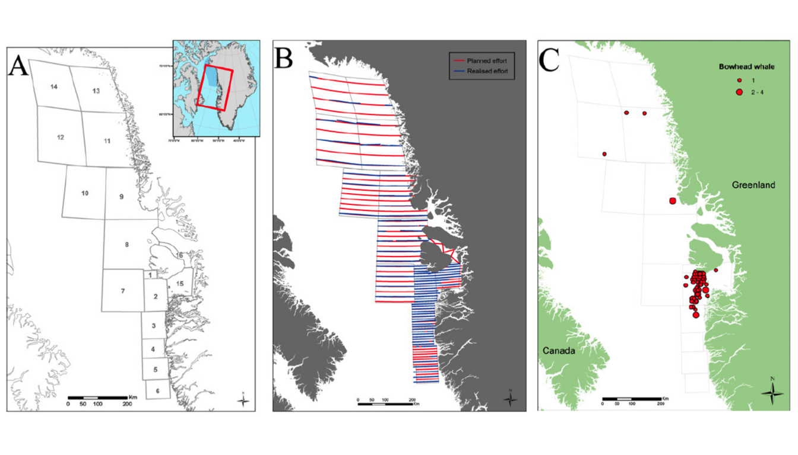

```{r Libraries and Logo, fig.align="center", message=FALSE, echo = FALSE, warning=FALSE, echox=FALSE, out.width="0.47\\linewidth"}
library(knitr)
include_graphics("Subject.png")
include_graphics("logo.png")
```
\
Students: 220024321, 180015716, 220013309
\
Lana - analysis and code, wrote methodology and results section.
\
Ifeanyi - abstract, introduction, and amended the code.
\
Erna - introduction, methodology, discussion, and amended the code.
\
We have evenly spread the work, if someone was struggling with a part, another person stepped in.
\
\
\
\

\newpage 

### Abstract
The study focuses on the population of bowhead whales in West Greenland, an area with history of exploitative whaling practise (Rekdal et al., 2015). The aim of the study is to estimate and analyse the bowhead whale and their group abundance using conventional distance sampling. A model using a half-normal detection function with no adjustments was selected. The estimated probability of detecting individual bowhead whales was 0.47 and detecting clusters was 0.61. Total estimated abundance was 228.82 (95% CI = 122.00; 429.14) for individuals and for clusters 183.93 (95% CI = 94.62; 357.54). These estimates are small compared to previous estimates from Heide-Jørgensen et al. (2007) and Wiig et al. (2011) which could suggest a lack of sufficient data to make robust estimates. Additionally as all assumptions of distance sampling are met therefore there is no concerns over the model.

### Introduction
Accurate estimation of animal populations is essential for wildlife management and conservation, as it helps to determine population numbers, monitor trends, and evaluate the effectiveness of conservation efforts (Elton, 1950; Bourlière, 1954). Animal populations are affected by various factors such as demographic, ecological, and human-related factors. Bowhead whales were commercially hunted in the early 16th century, leading to a drastic reduction in their population by the end of the 19th century. This led to research on their population and abundance in West Greenland, an area where their behaviour and activities are reliable indicators of population size and structure. One such area is Disko Bay, which has seasonal occurrences of bowhead whales. The International League of Nations agreed on worldwide protection of the species in 1931 to ensure their survival, and monitoring the abundance of their populations has remained crucial for their conservation today (Heide-Jørgensen,M.P. et al., 2007; Barkham, 1979; Woodby & Botkin, 1993; Rekdal et al., 2015).

```{r Survey Map, echo=FALSE, fig.align="center", out.width="0.50\\linewidth"}
# Include Map
library(htmltools)

# Include title
```
Figure 1:  (A) Strata map, (B) The planned transects (red) and surveyed transect lines (blue) and (C) the sightings of groups of bowhead whales (including uncertain and sightings with missing angle measurements) in West Greenland during aerial surveys in March–April 2012 (Rekdal et al., 2015)
\

This study assesses the detectability and abundance of bowhead whales in Disko Bay using distance data from the survey conducted by Rekdal et al. (2015). Based on the aerial survey, the number of bowhead whales in Disko Bay in 2006 was estimated to be 1,229 (CV = 0.47, 95% CI: 495-2,939) (Heide-Jrgensen et al. 2007). In this report, a sample representative portion of the area, i.e. plot distance sampling, is used to estimate the abundance. This methodology is widely used in ecological surveys to account for imperfect detections. 

\newpage 

### Methods
**Data Collection**
\
To collect data on bowhead whales, visual aerial line-transect surveys were conducted in coast land offshore areas in West Greenland between 65°400N and 75°300N, largely covering the area of the local spring aggregation in Disko Bay (Rekdal et al., 2015). The study region of 242,650km^2 was divided into 16 strata based on prior knowledge of anticipated densities of bowhead whales. Between 24th March and 14th April 2012 7836.5km of total east-west oriented transect lines were observed, with the targeted altitude and speed being 213m and 167 km/h respectively, the maximum perpendicular distance was set to 2,500m. Surveying was only carried out if Beaufort Sea States Code was 2 or less, i.e. only when the sea was calm. Inclinometers were used to measure the angle of declination for each observed group of bowhead whales (Suunto). Due to an obscured view close to the transect line, detections were left-truncated at 100m (Rekdal et al., 2015). 
\

**Data Analysis**
\
The bowhead whales further away are less likely to be detected, thus distance is employed as a detection bias. The detection function in distance sampling describes how detectability varies with distance, it includes the proportion and probability of animals being seen at a given distance. 8 models were fit to the distance data using all combinations of hazard-rate $g(x) = \exp(-(x / \sigma)^{-b})$, and half-normal $g(x) = \exp(-x^2 / 2\sigma^2)$ detection functions with cosine, hermite polynomial and simple polynomial adjustments. These functions use $\sigma$ as a scale parameter (“standard deviation”) and $b$ is used in hazard-rate functions to control the width of the shoulder. Model selection using Akaike information criterion (AIC) chose half-normal with no adjustments as the best model. AICc was also applied due to the ratio of model parameters to observations being less than 1:40 and found the same result (Takezawa, 2014). This model had a good fit; Cramer-von Mises test (T = 0.073, p = 0.732), bootstrap Kolmogorov-Smirnov test for goodness-of-fit (D = 0.073, p = 1). Additionally, a QQ plot comparing empirical and fitted CDF had points lying approximately on the 1:1 line. 
\

### Results
The model estimated the average detectability of **individual** bowhead whales to be 0.47. For individual Bowhead whales, the estimated abundance was highest in strata 2 (138.83, 95% CI = 291.53; 66.11) and lowest in strata 15 (5.12, 95% CI = 39.44; 0.67) (see fig. 2, table 1). The total estimated individual abundance was 228.82 (95% CI = 122.00; 429.14) (see fig. 2, table 1). Additionally strata 2 has the biggest difference in observed abundance compared to estimated abundance with 65 whales seen and 138.83 estimated (see fig. 2, table 1).
\

The model estimated the average detectability of **clusters** of Bowhead whales to be 0.61. Bowhead whale clusters were estimated to have the highest abundance also in strata 2 (106.79, 95% CI = 49.53; 230.28) (see fig. 3, table 1) which also has the largest difference between observed and estimated abundance (50 - 106.79). The total estimated cluster abundance was 183.93  (95% CI = 94.62; 357.54) (see fig. 3, table 1).
\

```{r Individual and Cluster Abundance Plots, echo = FALSE, warning = FALSE, results = "hide", message = FALSE, fig.show="hold", out.width="45%"}
library(janitor)
#####    SETTING UP    #####

# Set up packages 
library(Distance)
library(tidyverse)
library(remotes)
library(MuMIn)


# Getting Package Statsecol from github which contains the data
remotes::install_github("https://github.com/chrissuthy/statsecol")

# Loading in the data package
library(statsecol)


# Half-normal with no adjustment 
hn <- ds(data = bowhead_LT, 
         key = "hn", 
         adjustment = NULL ) 

# Making the data 
region_table <- unique(bowhead_LT[, c("Region.Label", 
                                      "Area")])
# Region and sample labels, effort
sample_table <- unique(bowhead_LT[, c("Region.Label", 
                                      "Sample.Label", 
                                      "Effort")])
# Object, region and sample labels
observation_table <- unique(bowhead_LT[, c("object", 
                                           "Region.Label", 
                                           "Sample.Label")])
# Finding the abundance and CI
abund_bio_hn <- dht(model = hn$ddf,
                    region_table, 
                    sample_table, 
                    observation_table)

# Viewing the abundance and CI and getting the tables for plotting
# Estimated Abundance of individuals
N_ind <- abund_bio_hn$individuals$N 
## INDIVIDUALS ##
# Changing the Region label to a factor
    # This allows it to be plotted in a desired order
N_ind <- N_ind %>%
  mutate(Label = factor(Label, levels = c("2", "3", "9", 
                                       "11", "12", "15",
                                       "Total" )))
# Summarising observed bowhead abundance
bowhead <- bowhead_LT %>% 
  mutate(Region.Label = factor(Region.Label, levels = c("2", "3", "9", 
                                                        "11", "12", "15"))) %>%
  drop_na() %>%
  group_by(Region.Label) %>%
  summarise(sum = sum(size), num = length(object)) %>%
  adorn_totals("row")
  
# Plotting estimated abundance data 
ggplot() +
  geom_point(data = N_ind, aes(x = Label, y = Estimate), 
             size = 3, 
             stat = "identity", 
             colour = "blue") +
# Plotting observed abundance 
  geom_point(data = bowhead, aes(x = Region.Label, y = sum),
             size = 3, 
             colour = "black") +
  # Adding lines for Confidence Intervals
  geom_linerange(data = N_ind, aes(x = Label, 
                     ymin = lcl,
                     ymax = ucl), colour = "darkblue", size = 1) +
  
  # Addding labels for axis and figure legend
  xlab("Survey Strata") +
  ylab("Estimated Abundance") +
  
  # Increase size of text
  theme(plot.caption = element_text(hjust = 0, size = 11)) +
  # Making the caption sit at the left
  theme(plot.caption = element_text(hjust = 0)) +
  
  # Adding more Y axis ticks to make estimates easier to interpret
  scale_y_continuous(breaks = round(seq(min(N_ind$lcl),
                                        max(N_ind$ucl), 
                                        by = 100))) +
  # Title for easy distingishing
  labs(title = "Individuals") +
  # Making the text bigger
  theme(axis.text = element_text(size = 12), 
        axis.title = element_text(size = 17), 
        plot.title = element_text(size = 20)) 
## CLUSTERS ##
# Estimated Abundance of clusters
N_clu <- abund_bio_hn$clusters$N 
# Changing the Region label to a factor
# This allows it to be plotted in a desired order
N_clu <- N_clu %>%
  mutate(Label = factor(Label, levels = c("2", "3", "9", 
                                       "11", "12", "15",
                                       "Total")))
# Summarising observed bowhead abundance
bowhead <- bowhead_LT %>% 
  mutate(Region.Label = factor(Region.Label, levels = c("2", "3", "9", 
                                                        "11", "12", "15"))) %>%
  drop_na() %>%
  group_by(Region.Label) %>%
  summarise(sum = sum(size), num = length(object)) %>%
  adorn_totals("row")
  
# Plotting estimated abundance data 
ggplot() +
  geom_point(data = N_clu, aes(x = Label, y = Estimate), 
             size = 3, 
             stat = "identity", 
             colour = "seagreen") +
# Plotting observed abundance 
  geom_point(data = bowhead, aes(x = Region.Label, y = num),
             size = 3, 
             colour = "black") +
  
  # Adding lines for Confidence Intervals
  geom_linerange(data = N_clu, aes(x = Label, 
                     ymin = lcl,
                     ymax = ucl), colour = "darkgreen", size = 1) +
  
    # Making the text bigger
  theme(axis.text = element_text(size = 12), 
        axis.title = element_text(size = 17), 
        plot.title = element_text(size = 20)) +
  
  # Adding labels for axis and figure legend
  xlab("Survey Strata") +
  ylab("Estimated Abundance") +
  
  # Increase size of text
  theme(plot.caption = element_text(hjust = 0, size = 11)) +
  # Making the caption sit at the left
  theme(plot.caption = element_text(hjust = 0)) +
  
  # Adding more Y axis ticks to make estimates easier to interpret
  scale_y_continuous(breaks = round(seq(min(N_clu$lcl),
                                        max(N_clu$ucl), 
                                        by = 100))) +
  # Title for distingusing graphs
  labs(title = "Clusters")
```
\

Figure 3: Individuals: Estimated abundance of individuals in each strata (blue dots),  the 95% confidence intervals for estimates (blue) lines and the observed individual abundance (black dots). Clusters: Estimated abundance of clusters in each strata (blue dots), 95% confidence intervals for estimates (blue lines) and the observed cluster abundance in each strata (black dots) 
\

```{r Table with Results, echo = FALSE, results="asis", message=FALSE, error=FALSE, out.width="0.45\\linewidth"}
# Results table for individuals
abundance_table_ind <- N_ind[, c(1:2, 5:6)]
# Round to 2 decimal places
abundance_table_ind <- round(abundance_table_ind[, 2:4], 2)
# Rename columns
colnames(abundance_table_ind) <- c("Individual Abundance Estimates", "Lower CI", "Upper Cl")
# Do the same with cluster table
abundance_table_clu <- N_ind[, c(1:2, 5:6)]
# Round to 2 decimal places
abundance_table_clu <- round(abundance_table_clu[, 2:4], 2)
# Rename columns
colnames(abundance_table_clu) <- c("Cluster Abundance Estimates", "Lower CI", "Upper Cl")
# Print the tables
#kable(abundance_table_ind, caption = "Abundance Estimates for Individuals")
#kable(abundance_table_clu, caption = "Abundance Estimates for Clusters")
# Merge tables with an empty column between them
abundance_table <- cbind(abundance_table_ind, abundance_table_clu)
# Print the table
kable(abundance_table, caption = "Abundance Estimates for Individuals, Abundance Estimates for Clusters")
```

## Discussion
The study found that the total individual bowhead whale estimate to be 228.82 (CI: 122.00; 429.14). This is a much smaller estimate compared to estimates by Heide-Jørgensen et al. (2007) that found 1,229 individuals (95% CI: 495; 2,939) in 2006 and Wiig et al. (2011) that found 410 individuals (95% CI: 783; 2,038) from 2000–2010. This could suggest that there has been a decline in the Bowhead whale population in Disko Bay. Alternatively it could suggest that the survey done by Rekdal et al., (2015) was not sufficient enough to gain a robust estimate of abundance. Further studies of the Bowhead Whale population may be required to gain more accurate estimates of abundance. Additionally here is a large amount of error in the estimates shown in the large confidence intervals. This is likely due to the small number of detections of whales in each stratum. Therefore this gives more evidence that the survey data could not be sufficient to make robust estimated of abundance. 

The estimates should be robust in terms of the model as the the assumptions of distance sampling were met. The perpendicular distance distribution of detections revealed a slight reduction in detection frequency close to the transect line, implying a somewhat obscured view, which would result in underprediction. Detections were, therefore, left-truncated at 100 m, satisfying the assumption of perfect detection at this distance. As inclinometers were used to measure the angle of declination, perpendicular distances from line to animal are uniform random variables. Distances have been measured using targeted plane altitude and speed, indicating that the survey was completed with great care and that it was accurately measured to the initial plane location. As of the data surveying description, it is concluded that the assumptions have been satisfied.
\

## References
Barkham, S. H. (1984). The Basque Whaling Establishments in Labrador 1536-1632 - A Summary. ARCTIC, 37(4). https://doi.org/10.14430/arctic2232
\

Bockstoce, J. R., & Burns, J. J. (1993). Commercial Whaling in the North Pacific Sector. In The Bowhead Whale. Society for Marine Mammalogy.
\

Heide-Jørgensen, M. P., Laidre, K., Borchers, D., Samarra, F., & Stern, H. (2007). Increasing abundance of bowhead whales in West Greenland. Biology Letters, 3(5), 577–580. https://doi.org/10.1098/rsbl.2007.0310
\

Miller, D. L., Burt, M. L., Rexstad, E. A., & Thomas, L. (2013). Spatial models for distance sampling data: recent developments and future directions. Methods in Ecology and Evolution, 4(11), 1001–1010. https://doi.org/10.1111/2041-210X.12105
\

Rekdal, S. L., Hansen, R. G., Borchers, D., Bachmann, L., Laidre, K. L., Wiig, Ø., Nielsen, N. H., Fossette, S., Tervo, O., & Heide-Jørgensen, M. P. (2015). Trends in bowhead whales in West Greenland: Aerial surveys vs . genetic capture-recapture analyses. Marine Mammal Science, 31(1), 133–154. https://doi.org/10.1111/mms.12150
\

Takezawa, K. (2014). Learning Regression Analysis by Simulation. Springer Japan. https://doi.org/10.1007/978-4-431-54321-3
\

Wiig, Ø., Heide-Jørgensen, M., Lindqvist, C., Laidre, K., Postma, L., Dueck, L., Palsbøll, P., & Bachmann, L. (2011). Recaptures of genotyped bowhead whales Balaena mysticetus in eastern Canada and West Greenland. Endangered Species Research, 14(3), 235–242. https://doi.org/10.3354/esr00365
\

Woodby, D. A., & Botkin, D. B. (1993). Stock Prices Prior to Commercial Whaling. In The Bowhead Whale. Society for Marine Mammalogy.
\

## Appendix

R Analysis Code
```{r Setting up, echo=TRUE, eval=FALSE}
#####    SETTING UP    #####
# Getting Package Statsecol from github which contains the data
remotes::install_github("https://github.com/chrissuthy/statsecol")
# Loading in the data package
library(statsecol)
# Set up libraries 
library(Distance)
library(tidyverse)
library(remotes)
library(MuMIn)
```
\
```{r Exploratory Analysis, echo=TRUE, eval=FALSE}
#####    EXPLORATORY ANALYSIS    #####
# Inspect data
df <- str(bowhead_LT)
# Looking at the distribution of the distances
# Setting up the plot size
par(mfrow = c(1,1), 
    # Set margins
    mar = c(5, 4, 4, 2) + 0.1) 
# Plot histogram of distances
hist(bowhead_LT$distance,
     # Naming x-axis 
     xlab = "Distance (km)", 
     # Naming y axis
     ylab = "Number of Bowhead Whales",  
     # Naming plot 
     main = "Distances of Bowhead Whales from Line Transects",
     # Changing colour and intensity of bars
     col = adjustcolor("seagreen", 0.5), 
     # Changing orientation of x-axis tick labels
     las = 1) 
```
\
```{r Modelling, echo=TRUE, eval=FALSE}
#####     MODELLING     #####
# Due to the long shoulder seen in the histogram, first fit a hazard rate;
#   then fit a half-normal.
# Fitting hazard-rate detection functions with all adjustment terms.
# Hazard-rate with no adjustment.
hr <- ds(data = bowhead_LT, 
         key = "hr", 
         adjustment = NULL) 
# Hazard-rate with a cosine adjustment 
hr_cos <- ds(data = bowhead_LT, 
             key = "hr", 
             adjustment = "cos")
# Hazard-rate with a hermite polynomial adjustment 
hr_herm <- ds(data = bowhead_LT, 
              key = "hr", 
              adjustment = "herm")
# Hazard-rate with a simple polynomial adjustment 
hr_poly <- ds(data = bowhead_LT, 
              key = "hr", 
              adjustment = "poly") 
# Fitting half-normal detection functions with all adjustment terms. 
# Half-normal with no adjustment.
hn <- ds(data = bowhead_LT, 
         key = "hn", 
         adjustment = NULL) 
# Half-normal with a cosine adjustment
hn_cos <- ds(data = bowhead_LT, 
             key = "hn", 
             adjustment = "cos") 
# Half-normal with a hermite polynomial adjustment
hn_herm <- ds(data = bowhead_LT, 
              key = "hn", 
              adjustment = "herm")
# Half-normal with a simple polynomial adjustment
hn_poly <- ds(data = bowhead_LT, 
              key = "hn", 
              adjustment = "poly")
```
\
```{r Model Selection, echo=TRUE, eval=FALSE}
#####     MODEL SELECTION     #####
# Comparing Models graphically by fit of detection probability over 
#   distance distribution
# Half-normal detection function over histogram plot
# Setting up plot size and margins
par(mfrow = c(2, 2), 
    # Set margins
    mar = c(5, 4, 4, 2) + 0.1) 
# Plotting all 4 half-normal models
plot(hn, 
     pl.col = adjustcolor("seagreen", 0.5),
     lwd = 1.2,
     bg = alpha("darkgoldenrod2", 0.3),
     pch = 21,
     main = "No Adjustment") 
plot(hn_cos,
     pl.col = adjustcolor("seagreen", 0.5),
     lwd = 1.2,
     bg = alpha("darkgoldenrod2", 0.3),
     pch = 21,
     main = "Cosine")
plot(hn_poly, 
     pl.col = adjustcolor("seagreen", 0.5),
     lwd = 1.2,
     bg = alpha("darkgoldenrod2", 0.3),
     pch = 21,
     main = "Polynomial")
plot(hn_herm, 
     pl.col = adjustcolor("seagreen", 0.5),
     lwd = 1.2,
     bg = alpha("darkgoldenrod2", 0.3),
     pch = 21,
     main = "Hermite Polynomial")
# Include titles for all of the plots
title("Half-Normal Models", 
      line = -1, 
      # Naming title and setting location
      outer = TRUE) 
# Hazard-rate Detection function over histogram plot
par(mfrow = c(2, 2), 
    # Setting up plot size and margins
    mar = c(5, 4, 4, 2) + 0.1) 
# Plotting all 4 hazard-rate models
plot(hr, 
     pl.col = adjustcolor("seagreen", 0.5),
     lwd = 1.2,
     bg = alpha("darkgoldenrod2", 0.3),
     pch = 21,
     main = "No Adjustment")
plot(hr_cos, 
     pl.col = adjustcolor("seagreen", 0.5),
     lwd = 1.2,
     bg = alpha("darkgoldenrod2", 0.3),
     pch = 21,
     main = "Cosine")
plot(hr_poly, 
     pl.col = adjustcolor("seagreen", 0.5),
     lwd = 1.2,
     bg = alpha("darkgoldenrod2", 0.3),
     pch = 21,
     main = "Polynomial")
plot(hr_herm, 
     pl.col = adjustcolor("seagreen", 0.5),
     lwd = 1.2,
     bg = alpha("darkgoldenrod2", 0.3),
     pch = 21,
     main = "Hermite Polynomial")
title("Hazard-Rate Models", 
      line = -1, 
      # Naming title and setting location
      outer = TRUE)
# Comparing AIC of all the models 
summarize_ds_models(hn, hn_cos, hn_herm, hn_poly, 
                    hr, hr_cos, hr_herm, hr_poly,
                    # Setting Plain instead of equations
                    output = "plain")
# As the dataset is small, checking whether AICc is a more appropriate measure
# To do this, Takezawa (2014) has said AICc should be used when the ratio of 
# your parameters to number of data points is less than 1:40.
# Print summary of hazard-rate distance model.
summary(hr)
  # Parameters = 2 : Observations = 58
  # Therefore ratio is 1:29
  #   This ratio will be even smaller for the models with adjustments 
# Print summary of half-normal distance model
summary(hn)
  # This is the only model that meets the assumptions of AIC however as you 
  #   Can"t compare across model selection parameters we will use AICc
# Using AICc to select models 
AICc(hn, hn_cos, hn_herm, hn_poly, 
     hr, hr_cos, hr_herm, hr_poly)
# Despite this there is no change in the best model
# The half-normal will be chosen as it has the smallest AIC and AICc
# No adjustment will be chosen as the adjustments don"t model extra variability 
#   in the data 
```
\
```{r Model Fit, echo=TRUE, eval=FALSE}
#####     MODEL FIT     #####
# Comparing the detection function to the cramer-von mises test.
# Setting plot size.
par(mfrow = c(1,2), 
    # Set margins
    mar = c(5, 4, 4, 2) + 0.1)
# Plotting the detetion function over the distances distribution
plot(hn, 
     which = 2, 
     pl.col = adjustcolor("seagreen", 0.5), 
     border = NULL,
     ylab = "Detection probability (g(x))", 
     xlab = "Distance", 
     las = 1,
     lwd = 1.4,
     bg = alpha("darkgoldenrod2", 0.3),
     pch = 21,
     main = "Half-normal Model No Adjustments")
# Plotting and running the Cramer-von Mises test and bootstrap Kolmogorov-Smirnov      
#   test for goodness-of-fit
gof_ds(hn, 
       main = "Expected vs Observed CDF", 
       lwd = 1.4,
       pch = 21,
       bg = alpha("darkgoldenrod2", 0.3),
       ks = TRUE,
       col = "darkgoldenrod4")
  # The Cramer-von Mises test gives a test statistic of 0.0732325 and a p-value 
  #   of 0.731882.
  # The Kolomogorov-Smirnov test gives a test statistic stat of 0.0725551 and a             
  #   p-value of 1.
# Therefore the model has a good fit as the p values are much more than 0.05.
```
\
```{r Model Inference, echo=TRUE, eval=FALSE}
#####     MODEL INFERENCE     #####
# Print summary of the model
summary(hn)
# Creating subsets of the column combinations needed for dht() density and 
#   abundance estimate and variances function.
# Region labels and areas. 
region_table <- unique(bowhead_LT[, c("Region.Label", 
                                      "Area")])
# Region and sample labels, effort
sample_table <- unique(bowhead_LT[, c("Region.Label", 
                                      "Sample.Label", 
                                      "Effort")])
# Object, region and sample labels
observation_table <- unique(bowhead_LT[, c("object", 
                                           "Region.Label", 
                                           "Sample.Label")])
# Finding the abundance and CI
abund_bio_hn <- dht(model = hn$ddf,
                    region_table, 
                    sample_table, 
                    observation_table)
# Viewing the abundance and CI and getting the tables for plotting.
# Estimated Abundance of individuals.
N_ind <- abund_bio_hn$individuals$N 
N_ind
# Estimated Abundance of clusters
N_clu <- abund_bio_hn$clusters$N 
N_clu
# Estimated density of individuals 
d_ind <- abund_bio_hn$individuals$D
d_ind 
# Estimated density of clusters
d_clu <- abund_bio_hn$clusters$D
d_clu
# Average probability of detection for individuals
abund_bio_hn$individuals$average.p 
# Average probability of detection for clusters
abund_bio_hn$clusters$average.p 
```
\
```{r Results Graphs, echo=TRUE, eval=FALSE}
##### GRAPHS FOR RESULTS #####
## INDIVIDUALS ##
# Changing the Region label to a factor.
    # This allows it to be plotted in a desired order.
N_ind <- N_ind %>%
  mutate(Label = factor(Label, levels = c("2", "3", "9", 
                                       "11", "12", "15",
                                       "Total"))) 
# Plotting estimates abundance data 
ggplot(N_ind) +
  geom_point(aes(x = Label, y = Estimate), 
             size = 2, 
             stat = "identity", 
             colour = "blue") +
  
  # Adding lines for Confidence Intervals
  geom_linerange(aes(x = Label, 
                     ymin = lcl,
                     ymax = ucl), colour = "darkblue") +
  
  # Addding labels for axis and figure legend
  xlab("Survey Strata") +
  ylab("Estimated Abundance") +
  labs(caption = "Figure 2: The estimated abundance of Bowhead whale individuals in each strata (blue dot) and \n the confidence intervals (blue) lines)") +
  
  # Making the caption sit at the left
  theme(plot.caption = element_text(hjust = 0)) +
  
  # Adding more Y axis ticks to make estimates easier to interpret
  scale_y_continuous(breaks = round(seq(min(N_ind$lcl),
                                        max(N_ind$ucl), 
                                        by = 100))) +
  # Title for easy distingishing
  labs(title = "Individual Abundance")
# Plotting individual estimated density data 
d_ind <- d_ind %>%
  mutate(Label = factor(Label, levels = c("2", "3", "9", 
                                       "11", "12", "15",
                                       "Total")))
ggplot(d_ind) +
  geom_point(aes(x = Label, y = Estimate), 
             stat = "identity", 
             size = 2,
             colour = "blue") +
  
  # Adding errorbars for Confidence Intervals
  geom_errorbar(aes(x = Label, 
                    ymin = lcl,
                    ymax = ucl), colour = "darkblue") +
  
  # Addding labels for axis and figure legend
  xlab("Survey Strata") +
  ylab("Estimated Density") +
  labs(caption = "Figure 3: The estimated density of Bowhead whale individuals in each strata (green dot) and \n the confidence intervals (green lines)") +
  
  # Making the caption sit at the left
  theme(plot.caption = element_text(hjust = 0)) +
  
  # Title to distinguish graphs
  labs(title = "Individual Density")
## CLUSTERS ##
# Changing the Region label to a factor
# This allows it to be plotted in a desired order
N_clu <- N_clu %>%
  mutate(Label = factor(Label, levels = c("2", "3", "9", 
                                       "11", "12", "15",
                                       "Total")))
# Plotting estimated abundance data 
ggplot(N_clu) +
  geom_point(aes(x = Label, y = Estimate), 
             size = 2, 
             stat = "identity", 
             colour = "#66FF00") +
  
  # Adding lines for Confidence Intervals
  geom_linerange(aes(x = Label, 
                     ymin = lcl,
                     ymax = ucl), colour = "darkgreen") +
  
  # Addding labels for axis and figure legend
  xlab("Survey Strata") +
  ylab("Estimated Abundance") +
  labs(caption = "Figure 4: The estimated abundance of Bowhead whale clusters in each strata (green dot) and \n the confidence intervals (green lines)") +
  
  # Making the caption sit at the left
  theme(plot.caption = element_text(hjust = 0)) +
  
  # Adding more Y axis ticks to make estimates easier to interpret
  scale_y_continuous(breaks = round(seq(min(N_clu$lcl),
                                        max(N_clu$ucl), 
                                        by = 100))) +
  # Title for distingusing graphs
  labs(title = "Cluster Abundance")
d_clu <- d_clu %>%
  mutate(Label = factor(Label, levels = c("2", "3", "9", 
                                       "11", "12", "15",
                                       "Total")))
str(bowhead_LT)
# Plotting cluster estimated density data 
ggplot(bowhead_LT) +
  geom_point(aes(x = Label, y = Estimate), 
             stat = "identity", 
             size = 2,
             colour = "#66FF00") 
  
  # Adding errorbars for Confidence Intervals
  geom_errorbar(aes(x = Label, 
                    ymin = lcl,
                    ymax = ucl), colour = "darkgreen") +
  
  # Addding labels for axis and figure legend
  xlab("Survey Strata") +
  ylab("Estimated Density") +
  labs(caption = "Figure 5: The estimated density of Bowhead whale clusters in each strata (green dot) and \n the confidence intervals (green lines)") +
  
  # Making the caption sit at the left
  theme(plot.caption = element_text(hjust = 0)) +
  
  # title to distinguish graphs
  labs(title = "Cluster Density")
```

```{r Results Table, echo=TRUE, eval=FALSE}
# Results table for individuals
abundance_table_ind <- N_ind[, c(1:2, 5:6)]
# Round to 2 decimal places
abundance_table_ind <- round(abundance_table_ind[, 2:4], 2)
# Rename columns
colnames(abundance_table_ind) <- c("Estimate", "Lower CI", "Upper Cl")
# Do the same with cluster table
abundance_table_clu <- N_ind[, c(1:2, 5:6)]
# Round to 2 decimal places
abundance_table_clu <- round(abundance_table_clu[, 2:4], 2)
# Rename columns
colnames(abundance_table_clu) <- c("Estimate", "Lower CI", "Upper Cl")
# Merge tables with an empty column between them
abundance_table <- cbind(abundance_table_ind, "", abundance_table_clu)
```
